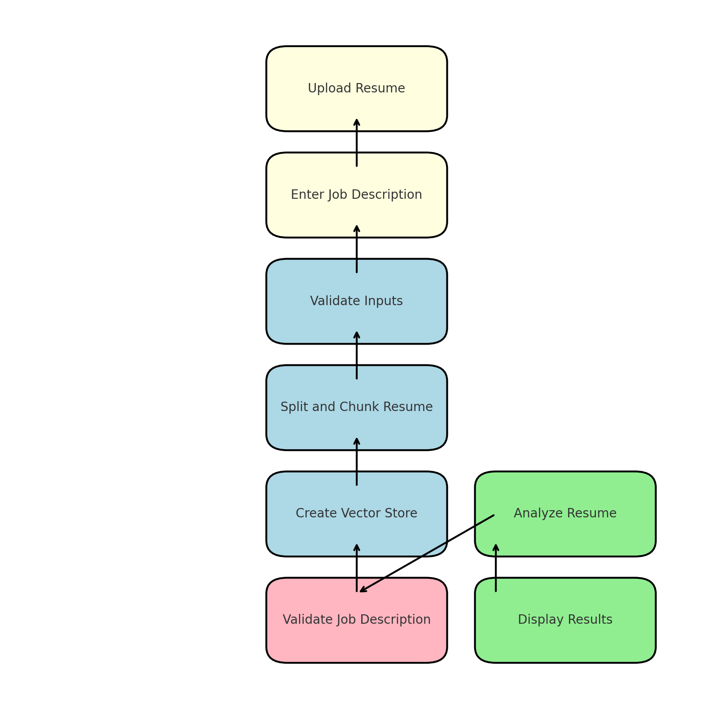

# AI Resume Analyzer

Welcome to the documentation for the **AI Resume Analyzer** project! This project aims to analyze resumes against job descriptions using advanced AI techniques. Below, you'll find an overview of the project, what I learned during its development, and the reasoning behind its creation.

---
## High-Level Design

Here's an overview of the infrastructure:

{ loading=lazy }
/// caption
AI-Resume Analyzer Design
///

## Overview

The AI Resume Analyzer is a tool designed to:
- Evaluate resumes against job descriptions.
- Provide actionable feedback for candidates.
- Help recruiters make informed decisions.

This project leverages:
- Streamlit for the frontend.
- Python libraries like `langchain` and `pypdf` for AI and PDF processing.
- Docker for containerization.

---

## Table of Contents

1. [What I Learned](what-i-learned.md)
2. [Reason for This Project](reason-for-project.md)
3. [LLM Overview](llm_overview.md)
4. [About Me](about.md)
5. [Resources](resources.md)

Click the links above to explore more about this project and its journey!
